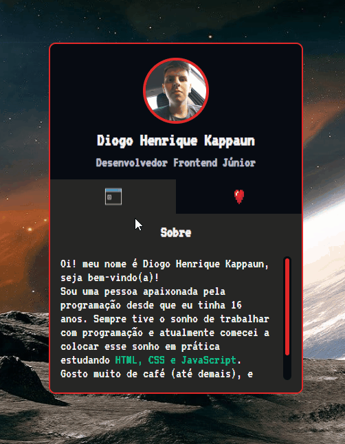

# Projeto com README
Um projeto de teste com um arquivo README 🚀



## Tecnologias utilizadas
- HTML
- CSS
- JS

## Como utilizar

1 - Clone do projeto
```
git clone <url>
```
2 - Acesse a pasta do projeto
```
cd repositorio-readme
```
3 - Acesse o VScode
```
code .
```